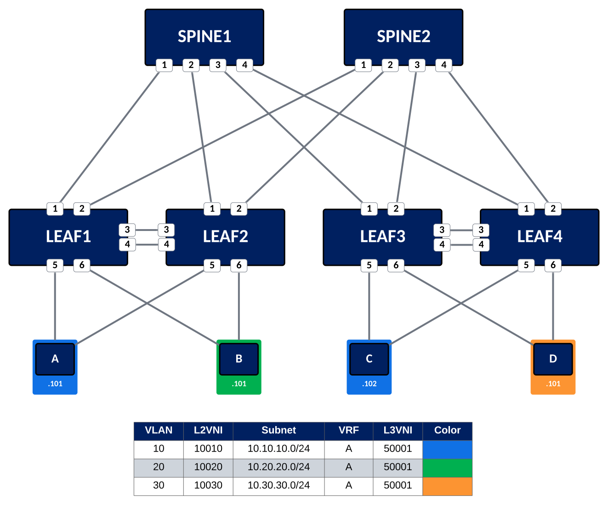
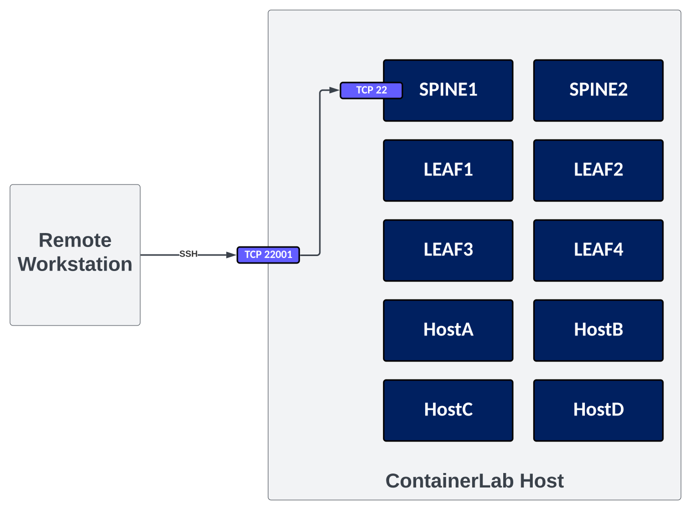

# Getting Started with ContainerLab

## **Introduction**

[ContainerLab](https://containerlab.dev) is an open source project that provides a quick and easy method to emulate network toplogies. The examples on this site will make use of Arista's cEOS-lab, but there is [wide ranging vendor support](https://containerlab.dev/manual/kinds/) for both containerized (and non-containerized) Network Operating Systems.

This guide will focus on how to quickly get started with ContainerLab.

## **Requirements**

Getting up and running with ContainerLab requires the following:

<div class="annotate" markdown>

- Linux host (this guide uses Ubuntu 20.04)
- Sufficient memory (1) and compute (2) to run desired topologies
- Docker
- ContainerLab
- Containerized Network Operating System of choice (3)

</div>

1. :pencil2: Containerized Network Operating Systems are much more resource efficient than their tradtionally virtualized conterparts. For example, as of 4.30.0F, each **cEOS-lab** node consumes ~850MB of memory when up and running. **vEOS-lab** requires 4GB.

2. :pencil2: Topologies are most CPU intensive at boot. There is a `startup-delay` toggle that can be used to help manage this when a topology is too large to simultaneously boot all nodes.

3. :pencil2: We will be using cEOS-Lab for this guide. However, we can use other Network Operating Systems to create large multi-vendor topologies as needed.

## **Installation**

### **Install Docker**

The first step is to install docker on the Linux host. [These instructions](https://www.digitalocean.com/community/tutorials/how-to-install-and-use-docker-on-ubuntu-20-04) cover, step by step, how to perform this isntallation on Ubuntu 20.04

### **Install ContainerLab**

This one-line command (taken from [this guide](https://containerlab.dev/install/#install-script)) will install ContainerLab on the Linux host:

```bash
# download and install the latest release (may require sudo)
bash -c "$(curl -sL https://get.containerlab.dev)"
```

We can validate that ContainerLab was installed by using the `sudo clab version` command:

```ini hl_lines="10"
mitch@mitchlab2:~$ sudo clab version

                           _                   _       _
                 _        (_)                 | |     | |
 ____ ___  ____ | |_  ____ _ ____   ____  ____| | ____| | _
/ ___) _ \|  _ \|  _)/ _  | |  _ \ / _  )/ ___) |/ _  | || \
( (__| |_|| | | | |_( ( | | | | | ( (/ /| |   | ( ( | | |_) )
\____)___/|_| |_|\___)_||_|_|_| |_|\____)_|   |_|\_||_|____/

    version: 0.41.2
     commit: fe51f41f
       date: 2023-05-18T14:57:44Z
     source: https://github.com/srl-labs/containerlab
 rel. notes: https://containerlab.dev/rn/0.41/#0412
```

### **Download Containerized NOS**

We will be using Arista's cEOS-lab in this guide. This is a free download that can be found under the **cEOS-lab** directory [here](https://www.arista.com/en/support/software-download) (1)
{ .annotate }

1. :pencil2: When downloading cEOS-lab, choose one of the images ending in `.tar.xz`

### **Import Containerized NOS**

Before defining, and booting, a topology; The containerized NOS will need to imported into Docker. This can be done via the following command:

```bash
sudo docker import [path to cEOS-lab .tar.xz file] ceos:[release ID]
```

As a more complete example, here is a command that imports cEOS64-lab-4.30.0F.tar.xz into docker as ceos:4.30.0F

```bash
sudo docker import cEOS64-lab-4.30.0F.tar.xz ceos:4.30.0F #(1)!
```

1. :pencil2: This command was run from the directory where the cEOS64-lab-4.30.0F.tar.xz image was located. This is not a requirement, but makes the example command easier to read.

We can validate that the image was imported by using the `sudo docker images` command:

```bash hl_lines="4"
mitch@mitchlab2:~$ sudo docker images
REPOSITORY            TAG       IMAGE ID       CREATED         SIZE
ceos                  trunk     1d73d2ef5663   7 days ago      2.37GB
ceos                  4.30.0F   0ca9c82f8c3b   2 weeks ago     2.47GB
mitchv85/devhost      latest    973bcbccca1d   3 weeks ago     1.83GB
netreplica/graphite   latest    96300cf0339b   11 months ago   206MB
```

### **Creating a Topology**

At this point, we have Docker host running on Ubuntu 20.04 with ContainerLab installed. We have also downloaded, and imported, cEOS-lab into Docker. :champagne:

Now, let's define a topology file that ContainerLab can use to create, and deploy, a topology

For reference, here is the topology we will be creating:

{: style="width:800px"}

ContainerLab makes use of YAML files to create, and deploy, topologies. For this topology, we'll create a file named `lab.yml` (1). This file, and it's components, are shown below for reference:
{ .annotate }

1. :pencil2: The topology file can be named whatever we'd like. We are just calling it `lab.yml`for simplicity.

???+ note
    This guide does not make use of all possible parameters in the topology file. For a complete list of parameters/options that can be defined in a ContainerLab topology file, please refer to the [ContainerLab Documentation](https://containerlab.dev/manual/nodes/)

```yaml
---
# -------------------------------------------------------------
# L3LS EVPN Demo Topology
# 2 Spines & 2 Leaf Pairs with MLAG
# -------------------------------------------------------------

name: evpn-demo #(1)!
prefix: "" #(2)!

mgmt: #(3)!
  network: mgmt
  ipv4-subnet: 172.100.100.0/24

topology:

  defaults:
    env:
      INTFTYPE: et #(4)!

  kinds: #(5)!
    ceos:
      image: ceos:4.30.0F #(6)!
    linux:
      image: mitchv85/devhost #(7)!

  nodes: #(8)!

#########################
# SPINES                #
#########################

    SPINE1: #(9)!
      kind: ceos #(10)!
      mgmt-ipv4: 172.100.100.101 #(11)!
      startup-config: startup-configs/SPINE1.cfg #(12)!
      ports: #(13)!
        - '22001:22' #(14)!
        - '8001:80' #(15)!
        - '44301:443' #(16)!

    SPINE2:
      kind: ceos
      mgmt-ipv4: 172.100.100.102
      startup-config: startup-configs/SPINE2.cfg
      ports:
        - '22002:22'
        - '8002:80'
        - '44302:443'

#########################
# LEAF                  #
#########################

    LEAF1:
      kind: ceos
      mgmt-ipv4: 172.100.100.103
      startup-config: startup-configs/LEAF1.cfg
      ports:
        - '22003:22'
        - '8003:80'
        - '44303:443'

    LEAF2:
      kind: ceos
      mgmt-ipv4: 172.100.100.104
      startup-config: startup-configs/LEAF2.cfg
      ports:
        - '22004:22'
        - '8004:80'
        - '44304:443'

    LEAF3:
      kind: ceos
      mgmt-ipv4: 172.100.100.105
      startup-config: startup-configs/LEAF3.cfg
      ports:
        - '22005:22'
        - '8005:80'
        - '44305:443'

    LEAF4:
      kind: ceos
      mgmt-ipv4: 172.100.100.106
      startup-config: startup-configs/LEAF4.cfg
      ports:
        - '22006:22'
        - '8006:80'
        - '44306:443'

###########################################
# HOSTS                                   #
###########################################

    HostA:
      kind: linux
      mgmt-ipv4: 172.100.100.201
      ports:
        - '22201:22'
      exec:
        - bash /usr/local/bin/hostnetconfig.sh -b -i 10.10.10.101/24 -g 10.10.10.1 #(17)!

    HostB:
      kind: linux
      mgmt-ipv4: 172.100.100.202
      ports:
        - '22202:22'
      exec:
        - bash /usr/local/bin/hostnetconfig.sh -b -i 10.30.30.101/24 -g 10.30.30.1

    HostC:
      kind: linux
      mgmt-ipv4: 172.100.100.203
      ports:
        - '22203:22'
      exec:
        - bash /usr/local/bin/hostnetconfig.sh -b -i 10.10.10.102/24 -g 10.10.10.1

    HostD:
      kind: linux
      mgmt-ipv4: 172.100.100.204
      ports:
        - '22204:22'
      exec:
        - bash /usr/local/bin/hostnetconfig.sh -b -i 10.20.20.101/24 -g 10.20.20.1

  links: #(18)!

####################
# SPINE1 to LEAF   #
####################
    - endpoints: ["SPINE1:et1", "LEAF1:et1"] #(19)!
    - endpoints: ["SPINE1:et2", "LEAF2:et1"]
    - endpoints: ["SPINE1:et3", "LEAF3:et1"]
    - endpoints: ["SPINE1:et4", "LEAF4:et1"]

####################
# SPINE2 to LEAF   #
####################
    - endpoints: ["SPINE2:et1", "LEAF1:et2"]
    - endpoints: ["SPINE2:et2", "LEAF2:et2"]
    - endpoints: ["SPINE2:et3", "LEAF3:et2"]
    - endpoints: ["SPINE2:et4", "LEAF4:et2"]

##################
# LEAF1 to LEAF2 #
##################
    - endpoints: ["LEAF1:et5", "LEAF2:et5"]
    - endpoints: ["LEAF1:et6", "LEAF2:et6"]

####################
# LEAF3 to LEAF4   #
####################
    - endpoints: ["LEAF3:et5", "LEAF4:et5"]
    - endpoints: ["LEAF3:et6", "LEAF4:et6"]

####################
# HOSTA            #
####################
    - endpoints: ["HostA:eth1", "LEAF1:et3"]
    - endpoints: ["HostA:eth2", "LEAF2:et3"]

####################
# HOSTB            #
####################
    - endpoints: ["HostB:eth1", "LEAF1:et4"]
    - endpoints: ["HostB:eth2", "LEAF2:et4"]

####################
# HOSTC            #
####################
    - endpoints: ["HostC:eth1", "LEAF3:et3"]
    - endpoints: ["HostC:eth2", "LEAF4:et3"]

####################
# HOSTD            #
####################
    - endpoints: ["HostD:eth1", "LEAF3:et4"]
    - endpoints: ["HostD:eth2", "LEAF4:et4"]
```

1. :pencil2: The name of the topology
2. :pencil2: (Optional) Setting the "prefix" of each lab node name to null. By default, the name of the lab is prepended to every node (container) that is created in the topology.
3. :pencil2: (Optional) Each node will have an IP assigned to it from this block. This is the equivalent of an "Out of Band Management" network in the cLab world; This network only exists within the cLab host (by default), and is used by the nodes for communication to/from the world outside of the Docker host.
4. :pencil2: (Optional) This setting is unique to cEOS-lab. It is required in order for the OSPF and IS-IS routing protocols to function properly on cEOS-lab nodes.
5. :pencil2: This is where we define the different **kinds** of containerized nodes we will be using in our topology.
6. :pencil2: Anywhere we define a node as `ceos`, it will run our imported 4.30.0F cEOS-lab image
7. :pencil2: Anywhere we define a node as `linux`, it will run the publicly available [mitchv85/devhost](https://hub.docker.com/repository/docker/mitchv85/devhost/general) image.
8. :pencil2: Here we start defining the nodes that will exist in our topology.
9. :pencil2: Defines the `SPINE1` node
10. :pencil2: Sets `SPINE1` node as running `ceos` ***kind*** of container. Which we set to ceos:4.30.0F
11. :pencil2: (Optional) Statically define the management address that we'd like assigned to the `SPINE1` node.
12. :pencil2: (Optional) Path to a defined startup-config that the `SPINE1` node should use when the topology is deployed
13. :pencil2: (Optional) Define a list of ports on the Docker Host that we'd like forwarded to the `SPINE1` node
14. :pencil2: (Optional) If an inbound connection to TCP port **22001** is received on the Docker host, it will forward this to TCP port **22** (SSH) on the `SPINE1` node
15. :pencil2: (Optional) If an inbound connection to TCP port **8001** is received on the Docker host, it will forward this to TCP port **80** (HTTP) on the `SPINE1` node
16. :pencil2: (Optional) If an inbound connection to TCP port **44301** is received on the Docker host, it will forward this to TCP port **443** (HTTP) on the `SPINE1` node
17. :pencil2: (Optional) Unique to the mitchv85/devhost image. Instructs cLab to run the `hostnetconfig.sh` shell script to configure IP addressing and/or LACP after deploying the node. More informaiton [here](https://hub.docker.com/repository/docker/mitchv85/devhost/general)
18. :pencil2: The `links` section is where we will define how nodes are to be connected together
19. :pencil2: Define a link between `SPINE1, Ethernet1` and `LEAF1, Ethernet1`. This can be customized for modular interfaces as well. For example, `et1_1_1` would evaluate to `Ethernet1/1/1` in cEOS-lab.

### **Deploying a Topology**

Next, let's tell ContainerLab to deploy our topology.

First, we'll check to see if any other topologies are running on the ContainerLab host by using the `clab inspect` command.

```bash
mitch@mitchlab2:~$ sudo clab inspect -a
INFO[0000] no containers found
```

The output above indicates that no other topologies are running on the ContainerLab host.

ContainerLab supports multiple topologies running in parallel on the same host. But, in this example, we want to make sure our topology is the only one running. Perhaps the ContainerLab host we're running only has enough resources to run our topology.

Next, we'll use the `clab deploy` command to deploy our topology.

```bash
mitch@mitchlab2:~$ sudo clab deploy -t lab.yaml #(1)!
```

1. In this example, `lab.yaml` exists in the current working directory. A path to the topology file could be specified here as well.

The output of this command, resulting in a successfully running topology, is below for reference:

```ini
INFO[0000] Containerlab v0.41.2 started
INFO[0000] Parsing & checking topology file: lab.yaml
INFO[0000] Creating lab directory: /home/mitch/avd-demo/clab-evpn-demo
INFO[0000] Creating docker network: Name="mgmt", IPv4Subnet="172.100.100.0/24", IPv6Subnet="", MTU="1500"
INFO[0000] Creating container: "HostB"
INFO[0000] Creating container: "HostA"
INFO[0000] Creating container: "HostC"
INFO[0000] Creating container: "HostD"
INFO[0000] Creating container: "SPINE2"
INFO[0000] Creating container: "LEAF2"
INFO[0000] Creating container: "LEAF4"
INFO[0000] Creating container: "LEAF1"
INFO[0000] Creating container: "SPINE1"
INFO[0000] Creating container: "LEAF3"
INFO[0001] Creating virtual wire: SPINE2:et3 <--> LEAF3:et2
INFO[0001] Creating virtual wire: SPINE2:et4 <--> LEAF4:et2
INFO[0001] Creating virtual wire: LEAF1:et6 <--> LEAF2:et6
INFO[0001] Creating virtual wire: LEAF3:et5 <--> LEAF4:et5
INFO[0001] Creating virtual wire: SPINE2:et1 <--> LEAF1:et2
INFO[0001] Creating virtual wire: SPINE1:et2 <--> LEAF2:et1
INFO[0001] Creating virtual wire: HostC:eth2 <--> LEAF4:et3
INFO[0001] Creating virtual wire: HostC:eth1 <--> LEAF3:et3
INFO[0001] Creating virtual wire: SPINE1:et3 <--> LEAF3:et1
INFO[0001] Creating virtual wire: SPINE2:et2 <--> LEAF2:et2
INFO[0001] Creating virtual wire: HostD:eth1 <--> LEAF3:et4
INFO[0001] Creating virtual wire: SPINE1:et4 <--> LEAF4:et1
INFO[0001] Creating virtual wire: SPINE1:et1 <--> LEAF1:et1
INFO[0001] Creating virtual wire: HostD:eth2 <--> LEAF4:et4
INFO[0001] Creating virtual wire: LEAF1:et5 <--> LEAF2:et5
INFO[0001] Creating virtual wire: LEAF3:et6 <--> LEAF4:et6
INFO[0004] Creating virtual wire: HostA:eth1 <--> LEAF1:et3
INFO[0004] Creating virtual wire: HostB:eth2 <--> LEAF2:et4
INFO[0004] Creating virtual wire: HostB:eth1 <--> LEAF1:et4
INFO[0004] Creating virtual wire: HostA:eth2 <--> LEAF2:et3
INFO[0005] Running postdeploy actions for Arista cEOS 'SPINE2' node
INFO[0005] Running postdeploy actions for Arista cEOS 'LEAF4' node
INFO[0005] Running postdeploy actions for Arista cEOS 'SPINE1' node
INFO[0005] Running postdeploy actions for Arista cEOS 'LEAF1' node
INFO[0005] Running postdeploy actions for Arista cEOS 'LEAF3' node
INFO[0005] Running postdeploy actions for Arista cEOS 'LEAF2' node
INFO[0048] Adding containerlab host entries to /etc/hosts file
INFO[0048] Executed command "bash /usr/local/bin/hostnetconfig.sh -b -i 10.10.10.101/24 -g 10.10.10.1" on the node "HostA". stdout:
INFO[0048] Executed command "bash /usr/local/bin/hostnetconfig.sh -b -i 10.10.10.102/24 -g 10.10.10.1" on the node "HostC". stdout:
INFO[0048] Executed command "bash /usr/local/bin/hostnetconfig.sh -b -i 10.20.20.101/24 -g 10.20.20.1" on the node "HostD". stdout:
INFO[0048] Executed command "bash /usr/local/bin/hostnetconfig.sh -b -i 10.30.30.101/24 -g 10.30.30.1" on the node "HostB". stdout:
+----+--------+--------------+------------------+-------+---------+--------------------+--------------+
| #  |  Name  | Container ID |      Image       | Kind  |  State  |    IPv4 Address    | IPv6 Address |
+----+--------+--------------+------------------+-------+---------+--------------------+--------------+
|  1 | HostA  | 9adcf1907483 | mitchv85/devhost | linux | running | 172.100.100.201/24 | N/A          |
|  2 | HostB  | afc129768461 | mitchv85/devhost | linux | running | 172.100.100.202/24 | N/A          |
|  3 | HostC  | dd028144e1e4 | mitchv85/devhost | linux | running | 172.100.100.203/24 | N/A          |
|  4 | HostD  | aca2670837e0 | mitchv85/devhost | linux | running | 172.100.100.204/24 | N/A          |
|  5 | LEAF1  | 1a7608f9dde2 | ceos:4.30.0F     | ceos  | running | 172.100.100.103/24 | N/A          |
|  6 | LEAF2  | d1da14cad69f | ceos:4.30.0F     | ceos  | running | 172.100.100.104/24 | N/A          |
|  7 | LEAF3  | 88dbd2141afb | ceos:4.30.0F     | ceos  | running | 172.100.100.105/24 | N/A          |
|  8 | LEAF4  | 87767a4684db | ceos:4.30.0F     | ceos  | running | 172.100.100.106/24 | N/A          |
|  9 | SPINE1 | 2ab18e4d33ad | ceos:4.30.0F     | ceos  | running | 172.100.100.101/24 | N/A          |
| 10 | SPINE2 | 04d7a820b0ae | ceos:4.30.0F     | ceos  | running | 172.100.100.102/24 | N/A          |
+----+--------+--------------+------------------+-------+---------+--------------------+--------------+
```

At this point, the topology is running and we can start interacting with it

### **Interacting with a Topology**

Connectivity to nodes in a given topology can be established in multiple ways. This guide will focus on two methods:

1. SSH directly to the nodes from a remote workstation
2. Connecting to the console of the nodes via the ContainerLab host

#### **SSH**

In order to SSH to the nodes from a remote workstation, a few items need to be in place first

1. The `Management0` interface on the node has an IP address in `mgmt.ipv4-subnet` network defined in the topology file
2. A default route pointing to a next-hop of the first usable address in the `mgmt.ipv4-subnet` network.

By default, the first usable address of the network defined in `mgmt.ipv4-subnet` is owned by the ContainerLab host, and is the out of band management "gateway" for the nodes in the topology.

For example, here is a snippet of the `SPINE1` node's startup-configuration

```yaml
vrf instance MGMT #(1)!
!
interface Management0
   vrf MGMT #(2)!
   ip address 172.100.100.101/24 #(3)!
!
ip route vrf MGMT 0.0.0.0/0 172.100.100.1 #(4)!
!
management ssh
   vrf MGMT
      no shutdown #(5)!
!
username admin privilege 15 role network-admin secret admin #(6)!
!
```

1. :pencil2: Define a VRF for Management.
2. Place the `Management0` interface into the MGMT VRF.
3. Statically define the IP address of the `Management0` interface.
4. Set a default route for the MGMT VRF. The next-hop is the first usable address in the network specified by `mgmt.ipv4-subnet` in the topology file.
5. Enable SSH on VRF MGMT on the cEOS-lab node.
6. Define a user that can be used when remotely accessing the node via SSH.

???+ tip
    Even though we've manually specified this information in the startup-config, ContainerLab can handle some of this automatically. More informaiton can be found [here](https://containerlab.dev/manual/kinds/ceos/)

With this configuration in place, we can now SSH to the node from a remote SSH session.

For this example we'll SSH to the `SPINE1` node, definied in our lab.yaml topology file, which is running on a ContainerLab host named `mitchlab2.packetanglers.com`

```bash hl_lines="1 4"
PS C:\Users\Mitch> ssh -p 22001 admin@mitchlab2.packetanglers.com
(admin@mitchlab2.packetanglers.com) Password:
Last login: Tue May 30 18:51:48 2023 from 24.29.218.185
SPINE1# exit
Connection to mitchlab2.packetanglers.com closed.
PS C:\Users\Mitch>
```

In the above output, we SSH'd to TCP port `22001`, which is what we definied in the port forwarding for the `SPINE1` node in our topology file

```bash hl_lines="6"
SPINE1:
    kind: ceos
    mgmt-ipv4: 172.100.100.101
    startup-config: startup-configs/SPINE1.cfg
    ports:
    - '22001:22'
    - '8001:80'
    - '44301:443'
```

A high level illustration of the SSH connectivity method, used to access `SPINE1` from a remote host, is shown below

{: style="width:800px"}

#### **Console via cLab Host**

Sometimes, usually for troubleshooting or getting some initial configuration on the node, there is a need to connect to the node's console directly from the ContainerLab host.

This can be done via the `docker exec` command, with an example for cEOS-lab shown below:

```bash hl_lines="1"
mitch@mitchlab2:~$ sudo docker exec -it SPINE1 Cli
SPINE1>en
SPINE1#
```

???+ tip
    The name of the node to connect to, in the example above `SPINE1`, can be found via the `sudo clab inspect` command.

### **Stopping a Topology**

Stopping a topology can be accomplished via the `clab destroy` command.

```bash
mitch@mitchlab2:~$ sudo clab destroy -t lab.yaml -c
```

???+ note
    The `-c` flag is used to specify "Cleanup". The full list of flags associated with the `destroy` command, and their respective use cases, can be found [here](https://containerlab.dev/cmd/destroy/)

Once this command is entered, the topology will be stopped, and the containers associated with the nodes will be removed.

The output of a successful `destroy` command is shown below:

```bash
INFO[0000] Parsing & checking topology file: lab.yaml
INFO[0000] Destroying lab: evpn-demo
INFO[0000] Removed container: HostC
INFO[0000] Removed container: HostA
INFO[0000] Removed container: HostD
INFO[0001] Removed container: HostB
INFO[0001] Removed container: SPINE1
INFO[0001] Removed container: SPINE2
INFO[0002] Removed container: LEAF4
INFO[0002] Removed container: LEAF2
INFO[0002] Removed container: LEAF3
INFO[0002] Removed container: LEAF1
INFO[0002] Removing containerlab host entries from /etc/hosts file
```

At this point, if our topology was the only one running on the ContainerLab host, the output of `sudo clab inspect -a` should return no active topologies

```bash
mitch@mitchlab2:~$ sudo clab inspect -a
INFO[0000] no containers found
```

Additionally, the ouptut of the `sudo docker ps -a` command should show no containers

```bash
mitch@mitchlab2:~$ sudo docker ps -a
CONTAINER ID   IMAGE     COMMAND   CREATED   STATUS    PORTS     NAMES
```

### **Forcing the removal of nodes**

In the event that an error is encountered when destroying a topology, and running or stopped containers are still listed in the output of `sudo docker ps -a`, the `sudo docker system prune` command can be used to force the removal of containers and any unused images.

```bash
mitch@mitchlab2:~$ sudo docker system prune
WARNING! This will remove:
  - all stopped containers
  - all networks not used by at least one container
  - all dangling images
  - all dangling build cache

Are you sure you want to continue? [y/N] y
Total reclaimed space: 0B
```

--8<-- "includes/abbreviations.md"
